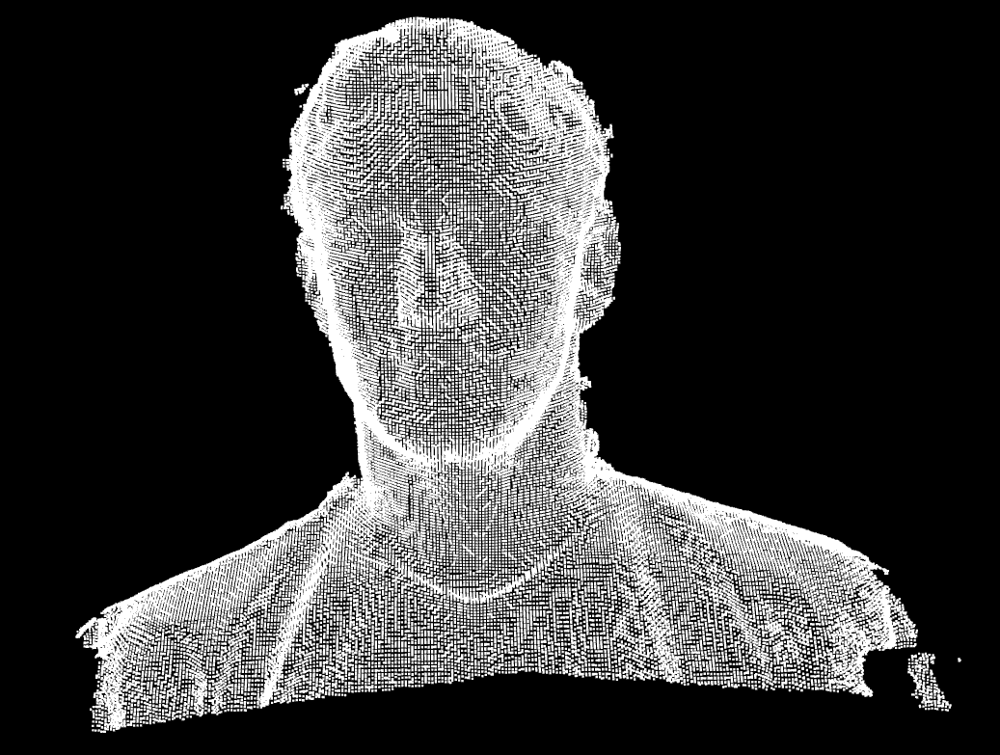
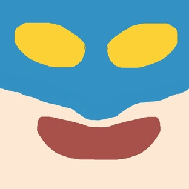
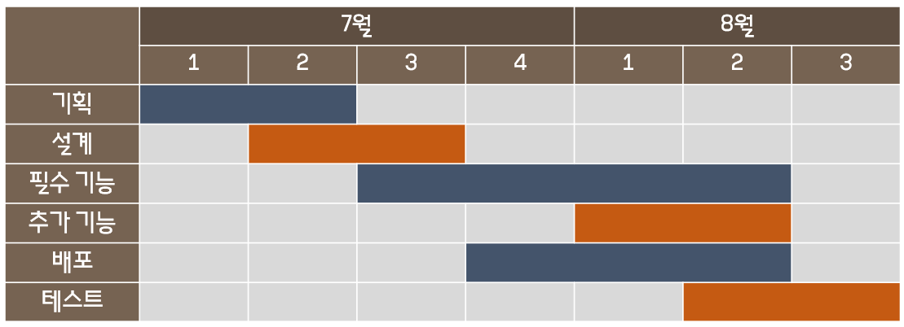
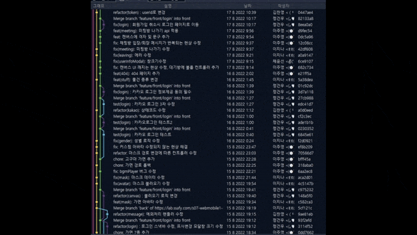
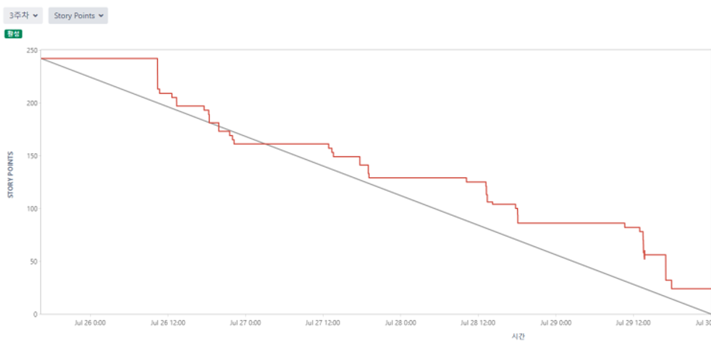
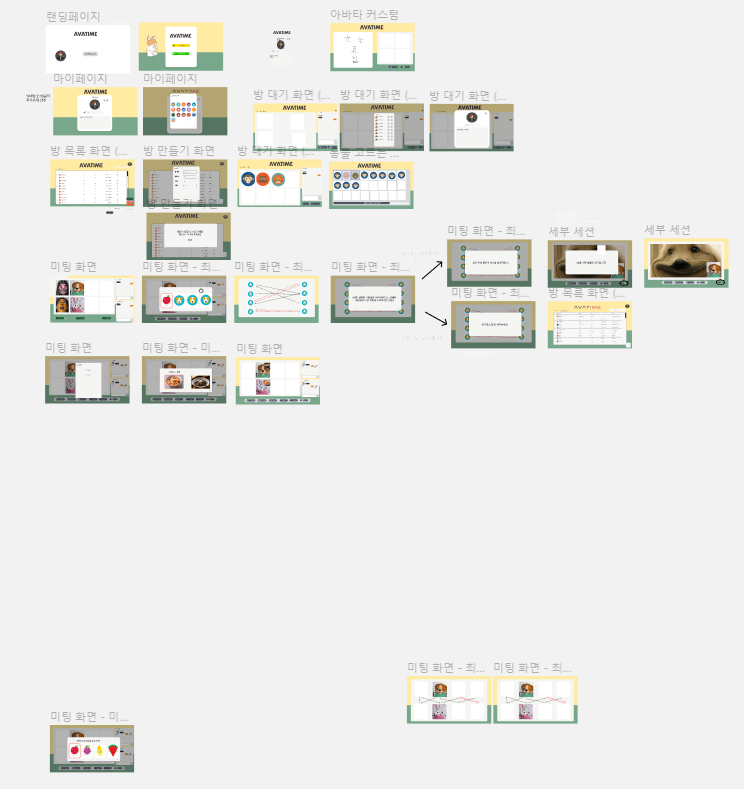
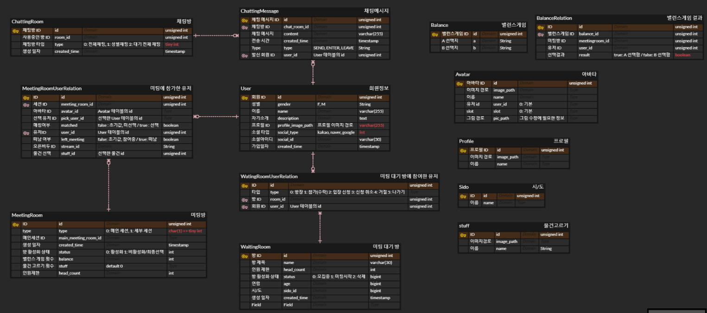
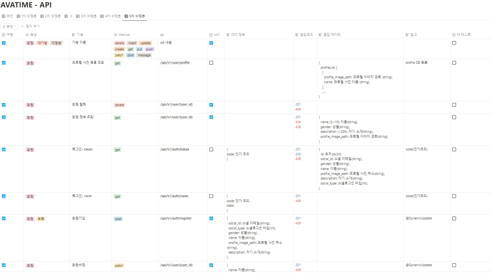
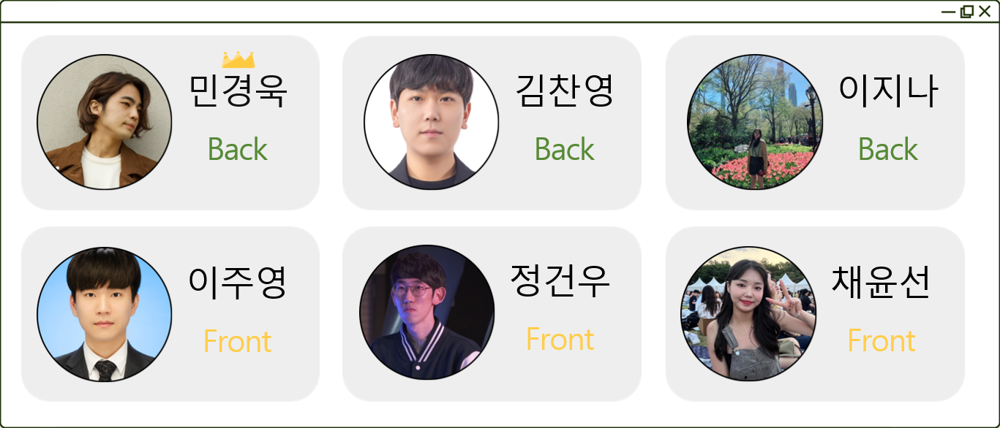

  <h5 style="font-weight: bold;">↑ GIF 파일을 클릭하면 UCC를 볼 수 있어요!</h5>
   
   

# 목차

1. [**서비스 소개**](#1)
2. [**기획 배경**](#2)
3. [**기능 소개**](#3)
4. [**시연 영상**](#4)
5. [**기술 스택**](#5)
6. [**프로젝트 일정 및 산출물**](#6)
7. [**개발 멤버 및 회고**](#7)

 

---

 

# 🐹서비스 소개

## 서비스 설명

### 개요

- 한줄 소개 : 내가 만든 가면으로 **미팅**하자
- 서비스 명 : **`AVATIME(아바타임)`**

### 타겟 🎯

- COVID-19 로 인해서 미팅에 쉽게 참여할 수 없게 된 사람들
- 가벼운 미팅을 하고 싶은 사람들
- 재미있고 새로운 미팅을 해보고 싶은 사람들

  > 👉 \*\* **미팅을 하고 싶은 모든 사람들** \*\*

# 🐹기획 배경

## 배경

일반적인 미팅 상황에서는 외모가 첫번째 판단요소가 되어 외모에 자신이 없는 사람들은 쉽게 선입견을 극복 할 수 없습니다. `AVATIME`은 이러한 외모지상주의를 타파하고 누구나 즐길 수 있는 미팅을 만들고자 하였습니다.
 
 
블라인드 아바타 미팅의 장점은 다음과 같습니다. 먼저. 얼굴이 가려진 상태로 다른사람들과 소통을 했을 때의 호기심이 극대화 되며, 특유의 분위기가 주는 설렘을 느낄 수 있고, 또한 블라인드라는 특성 때문에 미팅을 해보지 않은 사용자나, 외모가 장점이 아닌 사람들도 부담없이 서비스에 접근가능합니다.

## 목적 🥅

**처음 만나는 사람들끼리 부담없이 재미있는 미팅을 하게 하자**

## 의의

- 비대면 상황에서 직접 만나지 않고도 즐길 수 있는 온라인 비대면 미팅
- 아바타를 통해 상대를 바로 알 수 없다는 설렘 호기심 기대감
- 나만의 아바타를 사용하므로서 개성을 뽐내고 자심감 상승

# 🐹기능 소개

# 🐹시연 영상

## 회원가입

## 메인화면

## 마이페이지

## 아바타룸

## 대기방

## 방 입장

## 아바타 선택 화면 및 미팅방 입장

## 미니게임- 밸런스 게임

## 미니게임 - 물건 고르기

## 최종 선택

# 🐹기술 스택

## 1. webRTC

### webRTC란?

<aside>
WebRTC (Web Real-Time Communication)는 웹 브라우저 간에 플러그인의 도움 없이 서로 통신할 수 있도록 설계된 API 입니다.
음성 통화, 영상 통화, P2P 파일 공유 등으로 활용될 수 있습니다.

</aside>

### openvidu

WebRTC를 보다 간단하게 적용할 수 있고, 다양한 프레임워크와 호환성이 높은 openvidu를 사용하여 프로젝트를 진행했습니다.

### 적용

`AVATIME` 에서는 미팅시 화상 통화를 하기 위해 openVidu를 사용합니다.

## 2. Web Socket

### web Socket이란?

<aside>
웹 소켓은 사용자의 브라우저와 서버 사이의 인터액티브 통신 세션을 설정할 수 있게 하는 기술입니다. 
개발자는 웹 소켓 API를 통해 서버로 메시지를 보내고 서버의 응답을 위해 서버를 폴링하지 않고도 이벤트 중심 응답을 받는 것이 가능합니다.
</aside>

### 적용

`AVATIME` 에서는 실시간 상태 공유를 위해 다음 세 부분에서 webSocket을 사용합니다.

1.  채팅 (전체채팅, 성별채팅)
2.  방 목록화면
    -> 방의 상태(참여 유저 수, 게임시작유무)를 실시간으로 공유합니다.
3.  아바타 선택화면
    -> 다른 사용자가 어떤 아바타를 선택했는지 실시간으로 알 수 있고 아바타 중복 선택을 막을 수 있습니다.

## 3. Facemesh

> MediaPipe Face Mesh는 모바일 기기에서도 실시간으로 468개의 3D 얼굴 랜드마크를 추정하는 솔루션입니다. 머신 러닝(ML)을 사용하여 3D 얼굴 표면을 추론하므로 전용 깊이 센서 없이 단일 카메라 입력만 있으면 됩니다. 이 솔루션은 파이프라인 전반에 걸쳐 GPU 가속과 함께 경량 모델 아키텍처를 활용하여 라이브 경험에 중요한 실시간 성능을 제공합니다.

(출처: https://google.github.io/mediapipe/solutions/face_mesh.html)

## 4. Three js

> Three.js는 특정 웹 브라우저나 플러그인에 의존하지 않고 자바스크립트 언어를 사용하여 웹 컨텐츠의 한 부분으로서 그래픽 처리 장치(GPU)에서 가속되는 3차원 컨텐츠를 만들 수 있도록 해줍니다.

(출처: https://threejs.org/)

### 적용

`AVATIME` 에서는 Facemesh API를 적용해 추출한 3D 얼굴 랜드마크를 Threejs 라이브러리를 통해 사용자의 얼굴 위에 마스크를 그려냅니다.

추가로, 사용자가 그린 이미지를 적용하여 `AVATIME` 의 마스크 기능을 완성할 수 있었습니다. 왼쪽은 사용자가 직접 그린 액션가면 이미지 파일이고, 오른쪽은 해당 파일을 적용한 시연 영상입니다.

위 기술은 아래 깃헙을 참고하여 구현했습니다.

https://github.com/samarthgulati/ar-face-filters

## 5. 개발 환경

## 6. CI/CD 배포 환경

# 🐹프로젝트 일정 및 산출물

## 프로젝트 일정

## 프로젝트 진행
### 1. Git flow
---
Git flow 사용을 위해 `sourcetree` 프로그램을 사용하였고 우아한 형제들의 [git flow](https://techblog.woowahan.com/2553/)을 참고했습니다. front 와 back 으로 나누어 `faature`의 하위 브랜치를 사용하였으며 매일 오전 스크럼 이후 `back` 브랜치와 `front` 브랜치로 merge 하여 사용했습니다. 
`commit message`는 `feat(대기방): 채팅방 구현` 과 같이 통일하여 작성했습니다. 
   

### 2. Jira
---
매주 월요일 오전 회의에서 금주의 진행 이슈를 백로그에 등록했습니다. 전주에 완료하지 못한 이슈나, 앞으로 진행할 이슈들을 추가합니다.
- 에픽은 회원, 미팅, 설계 등으로 구성했습니다.
- 레이블은 BE, FE, full 으로 구성했습니다.
- 스토리는 명확한 전달을 위하여 `API 명세서 작성`와 같이 작성했습니다.
- 작업현황을 실시간으로 지라에 반영하여 현재 팀원이 어떤 작업을 하고있는지, 일정에 딜레이가 있는지 한 눈에 알아볼 수 있게 했습니다. 

## 프로젝트 산출물
### 1. Figma
?node-id=9003%3A179932)
 
### 2. ERD

 
### 3. API 문서

# 🐹개발 멤버 및 회고

- [민경욱](https://github.com/rrkcl7733) : 맡은 것을 끝까지 해내는 팀원들 덕분에 든든하게 의지하며 기획했던 만큼 무사히 마무리 할 수 있었습니다. 첫 기획을 단단하게 해야하며 문서화도 꼼꼼하게 작성해야 이후 일정이 순탄하게 진행될 수 있다는 것을 배웠습니다. 더불어 밝은 분위기로 서로의 의견이 존중받는 환경에서 개발하는 것이 결과물 향상에 도움이 되는 것을 배웠습니다. Django 가 메인 프레임워크였지만 Springboot 로 프로젝트를 진행하며 여러 프레임워크들의 특징을 알게 됐습니다. 또한 Git 과 Jira 를 경험했고, 브랜치 관리를 직접 수행하며 팀원들의 코드 상황을 한 눈에 파악하는 경험이 좋았습니다. 그리고 새벽 늦게까지 개발하고 밤잠 줄여가는 모습에 살아있음을 느꼈습니다. 다른 곳에 내놓기에 자랑스러운 프로젝트가 생겼다는 사실이 좋습니다.
- [김찬영](https://github.com/letgodchan0) : 6명의 팀원들과 함께 참여한 첫 대규모(?) 프로젝트였습니다. Web RTC라는 기술을 이용하여 직접 화상 미팅 서비스를 기획하고 개발하는게 쉽지 않았지만, 팀원들이 있어서 가능했던 것 같습니다. 6주라는 시간 동안 개발을 진행 하면서 IT 서비스를 개발하는 일련의 과정을 경험할 수 있었습니다. 기존에 파이썬만 사용하다가 자바 관련 프레임워크에 대한 이해를 할 수 있었고, Git이나 Jira와 같은 협업 툴도 배울 수 있었습니다. 마지막으로 직접 배포를 해보면서 Docker가 왜 필요한지, 젠킨스가 정말 효율을 증가시킬 수 있는 툴이구나 하는 것도 느낄 수 있었습니다. 무엇보다도 팀원들 간의 소통과 배려하는 모습들 덕분에 좋은 결과를 얻어낼 수 있었던 것 같습니다.
- [이지나](https://github.com/dlwlsk0428) : 이번 프로젝트에서 WebRTC, Web Socket, JPA 등 처음 접해보는 기술들이 많아 처음에는 힘들었지만, 팀원들 모두가 적극적으로 참여한 덕분에 6주라는 짧은 시간 동안 계획한 것들을 모두 구현할 수 있었습니다. 특히 git과 JIRA와 같은 협업툴의 적극적인 사용을 통해 오프라인에서의 만남이 적었던 상황에서도 원활한 소통을 하는 법을 배울 수 있어 좋았습니다. 중간에 가족 여행을 가서도 참여했을 만큼 최선을 다해 열정적으로 임했기 때문에 개인적으로 후회 없는 프로젝트가 되었음은 물론이고, 앞으로 제 자신을 소개할 때 당당하게 BackEnd 프로그래머라고 할 수 있을 것 같습니다. 우리 팀원들의 앞날에 늘 행운이 함께했으면 좋겠고, 다음 프로젝트는 더 발전되고 완성된 결과물을 내고 싶습니다!
- [이주영](https://github.com/2weeks0) : 처음 접했던 Web RTC라는 기술을 사용하는 프로젝트라 걱정이 앞섰습니다. 하지만 성실하고 유능한 멋진 팀원들을 만나 큰 어려움 없이 프로젝트를 진행할 수 있었습니다. 모든 팀원들이 적극적으로 참여해준 결과 만족스러운 서비스 기획을 할 수 있었고, 프로젝트 초반의 열정 그대로 개발, 테스트, 배포 단계까지 이어나갈 수 있었습니다.  
  개인적으로 이 프로젝트는 대 성공이라고 생각합니다. 그 이유는 프론트/백 엔드 팀원들 모두 각 분야에 재미를 느끼고, 더 공부하고 싶다는 욕구를 느끼게 해준 유익한 경험이 되었다고 생각하기 때문입니다. 그 원동력은 팀 구성원 하나하나가 좋은 팀원이 되었기 때문이 아닐까 생각합니다. 모든 팀원들에게 감사하다는 말을 하고 싶고, 모두들 고생하셨습니다~~  

- [정건우](https://github.com/abcxj123) : FrontEnd 세 명 모두 React를 사용해보지 않아서 스터디를 진행하며 학습 내용을 공유했던 것이 개발하는 데에 큰 도움이 된 것 같습니다. 이번 프로젝트를 진행하면서 React, TypeScript와 친해질 수 있어서 좋았고, 평소에 사용해보지 못했던 여러 API를 적용함에 따라 프로젝트 퀄리티가 올라가는 것을 보고 개발의 재미를 느꼈습니다.  
  여러 명과 함께하는 첫 웹 프로젝트여서 설렘 반 걱정 반 이었는데, 열심히 참여하는 팀원들을 만나서 프로젝트를 잘 마무리 할 수 있었던 것 같습니다. 다음 프로젝트도 새로운 기술들과 함께 재밌게 하고 싶어요!  

- [채윤선](https://github.com/younsunchae) : 좋은 팀원들을 만나 행복했습니다!! 기술적인 부분뿐만 아니라 팀워크, 협업, 소통의 중요성에 대해 많이 고민하고 또 많이 배우고 성장할 수 있었습니다. TS와 React를 처음 사용해보며, 시행착오도 겪었지만 타입을 명시해준 다는 것이 얼마나 큰 장점인지 깨달았습니다.  
  프로젝트 기간동안 최선을 다했기에 `AVATIME`에 대한 아쉬움은 없습니다! 제가 보기에도 멋진 프로젝트인 만큼 여러분이 보실 때도 그렇게 느껴졌으면 좋겠습니다. 앞으로 더 많이 배우며 어디서나 좋은 팀원일 수 있는 프론트엔드 개발자로 성장하고 싶습니다.
